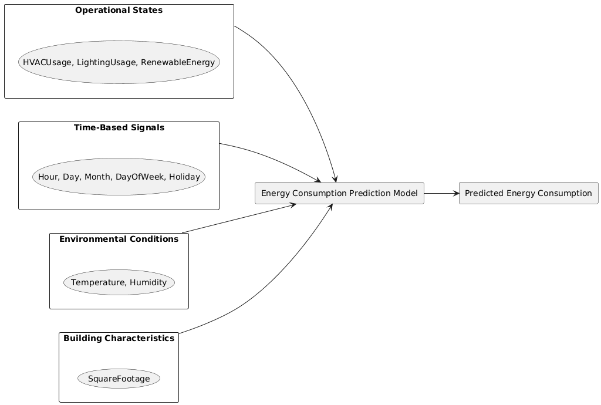
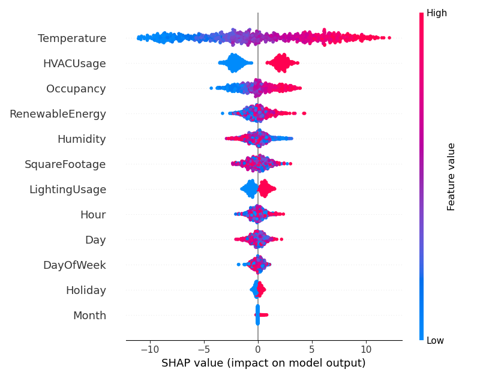
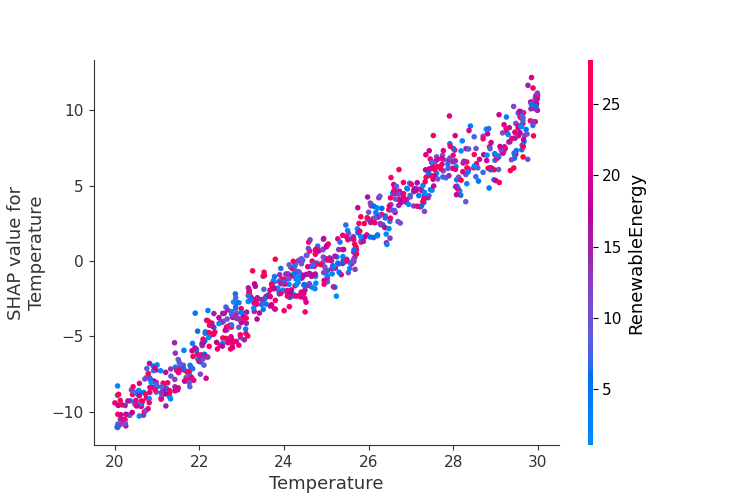
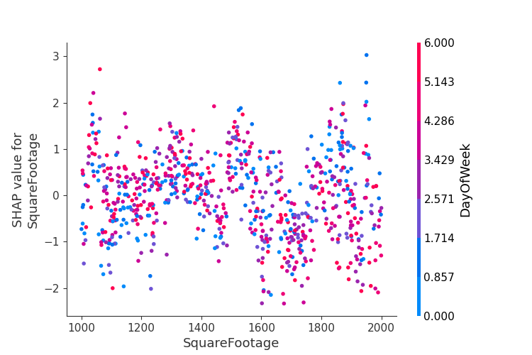
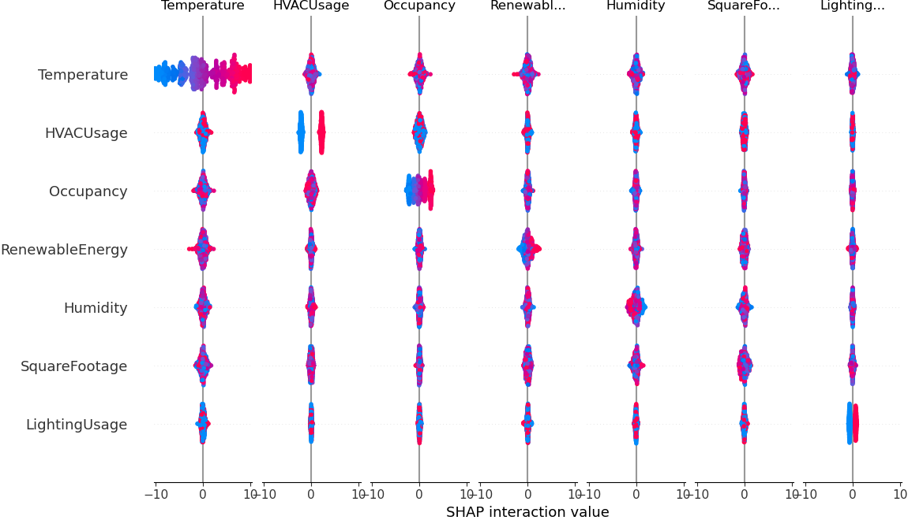

# Energy Consumption Prediction System


> A measured and explainable energy prediction system designed for interpretability, physical realism, and decision support.

---

## Table of Contents

- [Overview](#overview)
- [System Architecture](#system-architecture)
- [Dataset](#dataset)
- [Model Performance](#model-performance)
- [Feature Analysis](#feature-analysis)
- [Explainability](#explainability)
- [Installation](#installation)
- [Challenges & Solutions](#challenges--solutions)


---

## Overview

### System Purpose

This system predicts **building energy consumption** using environmental, operational, temporal, and structural variables while ensuring:

- **Interpretability** - Clear understanding of prediction drivers
- **Physical Realism** - Aligned with building physics and energy systems
- **Decision Support** - Suitable for operational and strategic planning
- **Extensibility** - Ready for future control and monitoring applications

### Key Features

- Predicts energy consumption with **MAE of 4.40** and **R² of 0.54**
- Full explainability layer using **SHAP analysis**
- Captures both structural baselines and dynamic operational states
- Models complex nonlinear relationships in thermal dynamics
- Provides actionable insights for energy optimization

---

## System Architecture

```
┌─────────────────┐
│   Raw Data      │
└────────┬────────┘
         │
         ▼
┌─────────────────────────────┐
│ Data Cleaning & Encoding    │
└────────┬────────────────────┘
         │
         ▼
┌─────────────────────────────┐
│   Feature Engineering       │
└────────┬────────────────────┘
         │
         ▼
┌─────────────────────────────┐
│   Train / Test Split        │
└────────┬────────────────────┘
         │
         ▼
┌─────────────────────────────┐
│ Model Training (LightGBM)   │
└────────┬────────────────────┘
         │
         ▼
┌─────────────────────────────┐
│   Prediction Output         │
└────────┬────────────────────┘
         │
         ▼
┌─────────────────────────────┐
│ Evaluation & Explainability │
└─────────────────────────────┘
```

---

## Dataset

### Overview
- **Records**: ~1,000 observations
- **Features**: 11 input variables
- **Target**: `EnergyConsumption` (continuous)

### Feature Inventory

| Subsystem | Feature | Description |
|-----------|---------|-------------|
| **Environmental** | Temperature | Outdoor temperature |
| **Environmental** | Humidity | Atmospheric humidity |
| **Structural** | SquareFootage | Building size |
| **Human Activity** | Occupancy | Number of occupants |
| **Operational** | HVACUsage | HVAC state (1=ON, 0=OFF) |
| **Operational** | LightingUsage | Lighting state (1=ON, 0=OFF) |
| **Energy Offset** | RenewableEnergy | On-site renewable contribution |
| **Temporal** | Hour | Hour of day (0-23) |
| **Temporal** | Day | Day of month (1-31) |
| **Temporal** | Month | Month of year (1-12) |
| **Temporal/Behavioral** | DayOfWeek | Weekday encoding (0-6) |
| **Temporal/Schedule** | Holiday | Holiday indicator (0/1) |


---

## Model Performance

### Evaluation Metrics

| Metric | Value | Interpretation |
|--------|-------|----------------|
| **RMSE** | 28.43 | Penalizes large prediction errors |
| **MAE** | 4.40 | Typical absolute error magnitude |
| **R²** | 0.54 | Variance explained by the system |

### Performance Interpretation

- **Low MAE** → Model performs well on typical cases
- **Higher RMSE** → Occasional large deviations during energy spikes
- **Moderate R²** → Captures major drivers while acknowledging inherent variability

> **System Insight**: Energy consumption contains both predictable structure and regime-based volatility, which is characteristic of real building operations.

---

## Feature Analysis

### Model Feature Importance


| Feature | Importance Score |
|---------|-----------------|
| SquareFootage | 1496 |
| Humidity | 1407 |
| RenewableEnergy | 1311 |
| Temperature | 1249 |
| Hour | 834 |
| Day | 828 |
| Occupancy | 633 |
| DayOfWeek | 424 |
| HVACUsage | 241 |
| LightingUsage | 206 |
| Holiday | 181 |
| Month | 30 |


*Figure 1: LightGBM feature importance rankings*

### Key Insights

- **SquareFootage** dominates as the structural baseline variable
- Environmental conditions (Temperature, Humidity) rank higher than direct control states
- Temporal resolution (Hour, Day) proves more influential than Month

> **Design Principle**: Structural and environmental variables define energy regimes more than control switches alone.

---

## Explainability

### SHAP Analysis

This system includes a comprehensive explainability layer using **SHAP (SHapley Additive exPlanations)** to:

- Move from "which features are used" to "how features affect predictions"
- Enable both local and global explainability
- Validate physical realism of the learned system

### Global Feature Impact


*Figure 2: SHAP summary plot showing feature contribution distributions*

**Key Findings**:
- **Temperature** exhibits the largest contribution magnitude (dominant *dynamic driver*)
- **SquareFootage** sets baseline but causes limited variability (dominant *structural anchor*)
- **RenewableEnergy** consistently offsets consumption
- Temporal variables show cyclical influence patterns

### SHAP Dependence Analysis


*Figure 3: SHAP dependence plot for Temperature*


*Figure 4: SHAP dependence plot for SquareFootage*

**Observations**:
- SquareFootage → Monotonic, stable contribution
- Temperature → Nonlinear, regime-based behavior

### SHAP Interaction Matrix


*Figure 5: SHAP interaction matrix*

**System-Level Conclusion**:
> Energy consumption behaves largely as a sum of independent subsystem contributions rather than a heavily entangled nonlinear system.

This aligns with:
- Building physics principles
- Control logic separation
- Standard energy accounting practices

---

## Installation

### Prerequisites

```bash
Python 3.8+
pandas
numpy
scikit-learn
lightgbm
shap
matplotlib
seaborn
```

### Setup

```bash
# Clone the repository
git clone https://github.com/yourusername/energy-consumption-prediction.git
cd energy-consumption-prediction

# Create virtual environment
python -m venv venv
source venv/bin/activate  # On Windows: venv\Scripts\activate

# Install dependencies
pip install -r requirements.txt
```

---


## Challenges & Solutions

| Challenge | Resolution |
|-----------|-----------|
| Non-numeric data types | Explicit numeric encoding for categorical variables |
| Binary operational states | Converted ON/OFF to 1/0 representation |
| Interpretability gap | Integrated SHAP analysis framework |
| Visualization requirements | Implemented static SHAP plots (waterfall, summary, dependence) |
| Conflicting feature rankings | Distinguished structural vs dynamic framing |

### Technical Resolution: Data Type Issue

**Problem Encountered**:
```
ValueError: pandas dtypes must be int, float or bool
Fields with bad pandas dtypes: DayOfWeek, Holiday
```

**Solution Applied**:
- Converted categorical schedule indicators to numeric representations
- DayOfWeek → 0–6 (Monday=0, Sunday=6)
- Holiday → 0 (No) / 1 (Yes)


## Contributing

Contributions are welcome! Please feel free to submit a Pull Request.

1. Fork the repository
2. Create your feature branch (`git checkout -b feature/AmazingFeature`)
3. Commit your changes (`git commit -m 'Add some AmazingFeature'`)
4. Push to the branch (`git push origin feature/AmazingFeature`)
5. Open a Pull Request

---


